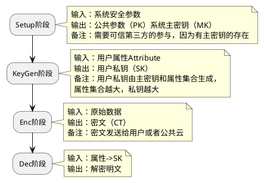

**Attribute-based encryption**

## 基本原理

四阶段

1. Setup阶段：
由授权机构执行，选择$y，t_1，t_2，...，t_n \in Z_q$，
生成系统公钥$PK=(T_1=g^{t_1}，...，T_n=g^{t_n}，Y=e(g，g)^y)$，
主密钥$MK=(y，t_1，t_2，...，t_n)$

2. KeyGen阶段：
授权机构执行，生成用户私钥，
随机选择$d-1$次多项式$p$，令$p(0)=y$，
用户的私钥$SK=\{D_i=g^{p(i)/t(i)}\}_{i\in A_u}$

3. Enc阶段：
发送方执行，用属性集$ A_c$对消息$M$进行加密，
选择随机数$s$，
密文为：$(A_C，E=Y^sM=e(g，g)^{ys}M，\{E_i=g^{t_is}\}_{i\in A_c})$

4. Dec阶段：
若$|A_u\cap A_c|>d$，
则选择$d$个属性，
计算$e(E_i，D_i)=e(g，g)^{p(i)s}$，
再用拉格朗日插值计算$Y^s=e(g，g)^{p(0)s}=e(g，g)^{ys}$，
得到$M=E/Y^s$

## ABE分类
* KP-ABE
key-policy attributed-based encryption
密钥与访问策略相关联，密文则是与属性相关

* CP-ABE
cipher-policy attributed-based encryption
密文与访问策略相关联，密钥则是与属性相关
  

