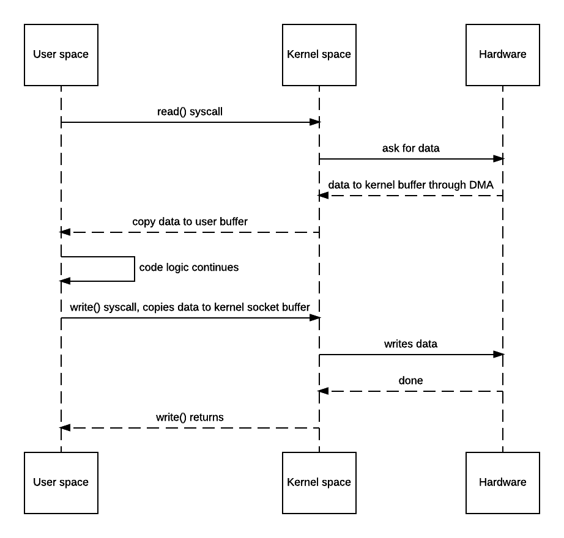
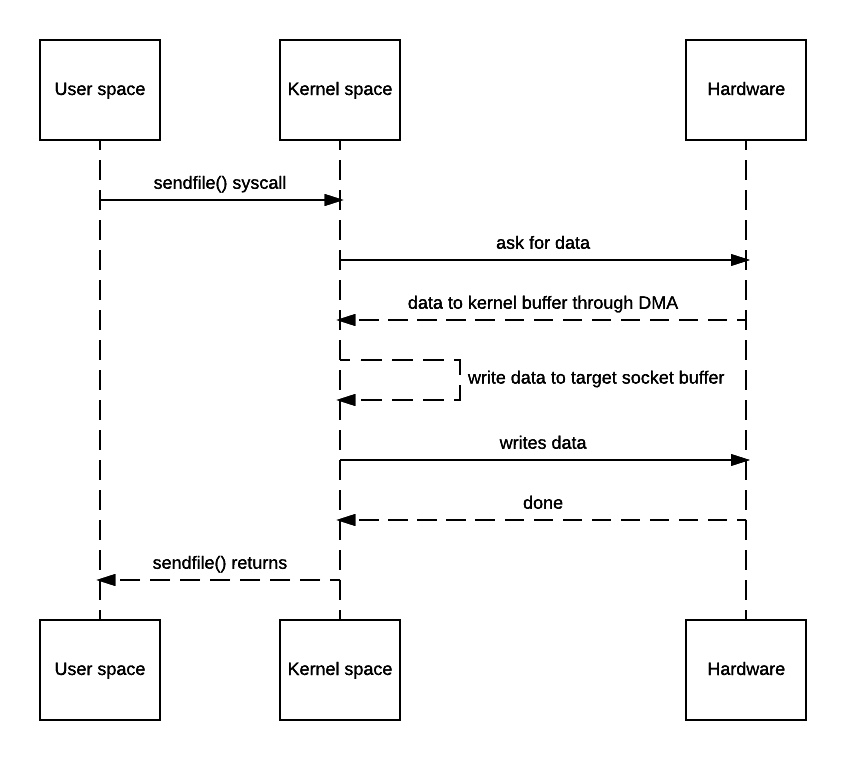
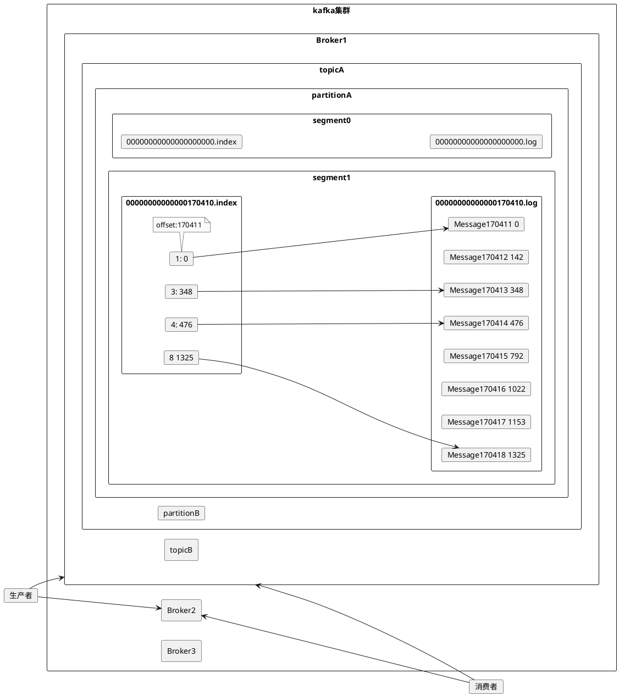
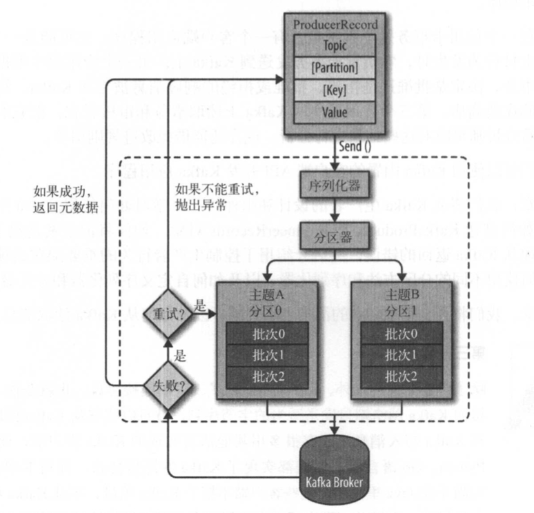

# 1. kafka数据存储
[TOC]

监控、权限

数据流转、配置

## 1.1. kafka的历史

Kafka最初是LinkedIn的一个内部基础设施系统，是为了解决LinkedIn数据管道问题应运而生的。它的设计目的不只是开发一个能够存储数据的系统，而是把数据看成是持续变化和不断增长的流，提供一个高性能的消息系统，可以处理多种数据类型，并能够实时提供纯净且结构优化的用户活动数据和系统度量指标。

Kafka一开始被用在社交网络的实时应用和数据流中，现在已经成为下一代数据架构的基础。

Kafka的命名是来源于Franz Kafka。Jay Kreps解释： 我想既然Kafka是为了写数据而产生的，那么用作家的名字来命名就会显得更有意义。我在大学时期上过很多文学课程，很喜欢Franz Kafka。

* 2010 作为开源项目在Github上发布，Kafka的诞生
* 2011 Kafka成为Apache软件基金会的孵化器项目
* 2012 Kafka从孵化器项目毕业
* 2014秋天 Jay Kreps成立Confluent公司，并着眼于Kafka。


## 1.2. kafka使用
### 1.2.1. Zookeeper安装

* 下载zookeeper
* 解压： tar xvf zookeeper-3.4.10.tar.gz
* 修改配置
  配置文件/zookeeper/zookeeper-3.4.10/conf/zoo.cfg
    + 路径配置
    > dataDir=/usr/local/zookeeper/data

    - dataDir为存储快照文件的目录，默认情况下，事务日志也会存储在该目录上。由于事务日志的写性能直接影响 ZooKeeper 性能，因此 建议同时配置参数dataLogDir
  > dataLogDir=/opt/data/zookeeper/logs

* 集群配置
  首先在 3 台机器的/etc/hosts 文件中加入 3 台机器 的 IP 与机器域名映射， 域名自定义， 这里分别命名为 server-I、 server-2、 server-3, 3 台机器 IP与机器域名映射关 系如下:
    
    >10.211.55.4 server-1    
    >10.211.55.5 server-2    
    >10.211.55.6 server-3    

    进入其中一台机器的Zookeeper安装路径conf，添加
    >server.1=server-1:2888:3888    
    >server.2=server-2:2888:3888    
    >server.3=server-3:2888:3888

    端口号2888表示该服务器与集群中leader交换信息的端口，默认为2888， 3888表示选举时服务器相互通信的端口。

    接着在${dataDir}路径下创建一个myid文件，myid存放的值就是服务器的编号，即对应上面的1、2、3。ZooKeeper在启动时会读取 myid文件 中的值与 zoo.cfg文件中的配置信息进行比较， 以确定是哪台服务器。

    将配置好的zoo.cfg拷贝到其他两台机器，并分别创建对应的myid。
    
    为了操作方便，我们可以将Zookeeper相关环境变量添加到/etc/profile文件中，如：
    
    >export ZOOKEEPER_HOME=/usr/local/zookeeper/zookeeper
    PATH=$PATH:$JAVA_HOME/bin:$JRE_HOME/bin:$ZOOKEEPER_HOME/bin

* 验证 

    启动zookepper:  
    zkServer.sh start   
    输出下面类似结果表示安装成功
    ```
    [root@centos7g zookeeper]# zkServer.sh start   
    ZooKeeper JMX enabled by default    
    Using config: /usr/local/zookeeper/zookeeper/bin/../conf/zoo.cfg    
    Starting zookeeper ... STARTED  
    ```
    查看zookepper状态:  
    zkServer.sh status   
    输出下面类似结果表示安装成功
    ```
    [root@centos7g zookeeper]# zkServer.sh status  
    ZooKeeper JMX enabled by default    
    Using config: /usr/local/zookeeper/zookeeper/bin/../conf/zoo.cfg    
    Mode: standalone    
    
     ```
    
    注意： centos7默认使用firewall作为防火墙，并默认开启， 在启动zk时需要关闭防护墙，不然无法通信。    
    查看防火墙状态： firewall-cmd --state   
    停止防火墙： systemctl stop firewalld.service   
    禁止防火墙开机启动：systemctl disable firewalld.service 

### 1.2.2. kafka安装
* 安装包    

    下载 kafka：http://kafka.apache.org/downloads
    目前我们使用 Kafka 版本为 kafka_2.11-1.0.0.tgz，其中 2.11 代表 Scala 版本， 1.0.0 表示 Kafka 的版本     
    解压： tar xvf kafka_2.11-1.0.0.tgz

    这里我们对kafka的环境变量进行设置， 在/etc/profile 文件中加入kafka的安装路径，

    >export KAFKA_HOME=/home/xxx/software/kafka_2.12-2.1.0
    PATH=\$PATH:\$JAVA_HOME/bin:\$JRE_HOME/bin:\$ZOOKEEPER_HOME/bin:\$KAFKA_HOME/bin
    
* 修改配置
    修改$KAFKA_HOME/config 目录下的server.properties文件，为了便于后续集群环境搭建的配置， 需要保证同一个集群下 broker.id要唯一，因此这里手动配置 broker.id, 直接保持与ZooKeeper的myid值一致， 同时配置日志存储路径。server.properties修改的配置 如下 :
    >broker.id=l #指定代理的 id     
    >log.dirs=/usr/local/kafka/log  #指定 Log 存储路径  
    >zookeeper.connect=10.200.195.75:2181,server-2:2181,server-3:2181   

    在三台机器上(或者同一台机器三个路径，以端口区分)分别修改配置文件server.properties, 并修改对应的broker.id.

* 启动  
    >kafka-server-start.sh -daemon ../config/server.properties   

    执行 jps命令查看 Java进程，此时进程信息至少包括以下几项:
    
    ```
    15976 Jps
    14999 QuorumPeerMain
    15906 Kafka
    ```

    通过 ZooKeeper 客户端登录 ZooKeeper 查看目录结构，执行以下命令:
    >zkCli.sh -server 127.0.0.1:2181 #登录 ZooKeeper     
    ls / #查看 ZooKeeper 目录结构   
    ls /brokers/ids 输出 [1, 2, 3]

    由/brokers/ids 节点存储的元数据可知， 3台机器的 Kafka 均已正常己启动。
    
### 1.2.3. kafka Demo

#### 1.2.3.1. normal Test
* 创建一个拥有3个副本的topic:

  ```
  [root@centos7g kafka]# kafka-topics.sh --create --zookeeper 127.0.0.1:2181 --replication-factor 3 --partitions 1 --topic my-replicated-topic
  Created topic "my-replicated-topic".
  [root@centos7g kafka]# 
  [root@centos7g kafka]# kafka-topics.sh --list --zookeeper 127.0.0.1:2181
  my-replicated-topic

  ```

  现在我们搭建了一个集群，获取节点信息：
  ```
  [root@centos7g bin]# kafka-topics.sh --describe --zookeeper 127.0.0.1:2181 --topic my-replicated-topic
  Topic:my-replicated-topic	PartitionCount:1	ReplicationFactor:3	Configs:
    Topic: my-replicated-topic	Partition: 0	Leader: 753	Replicas: 753,751,752	Isr: 753,751,752
  [root@centos7g bin]# 
  ```
  - Leader: 负责处理消息的读和写，leader是从所有节点中随机选择的.
  - Replicas：列出了所有的副本节点，不管节点是否在服务中.
  - Isr：是正在服务中的节点.

  在我们的例子中，节点753是作为leader运行。

* 修改topic过期时间
  默认是7天 修改为3天
  ```
  kafka-topics.sh --zookeeper 127.0.0.1:2181 -topic my-replicated-topic --alter --config retention.ms=259200000
  ```
  
* 往topic发送消息：
  ```
  kafka-console-producer.sh --broker-list 10.200.195.75:9092 --topic my-replicated-topic

  >1
  >2
  >test1
  >4
  ```

* 消费这些消息：
  ```
  kafka-console-consumer.sh --bootstrap-server 10.200.195.75:9092 --from-beginning --topic my-replicated-topic

  1
  2
  test1
  4
  ```

#### 1.2.3.2. 容错test

* 获取节点信息
  
  kafka-topics.sh --describe --zookeeper 127.0.0.1:2181 --topic my-replicated-topic

  ```
  [root@centos7g local]# kafka-topics.sh --describe --zookeeper 127.0.0.1:2181 --topic my-replicated-topic
  Topic:my-replicated-topic	PartitionCount:1	ReplicationFactor:3	Configs:retention.ms=259200000
    Topic: my-replicated-topic	Partition: 0	Leader: 753	Replicas: 753,751,752	Isr: 753,751,752
  ```

* kill leader

  broker 753 作为leader运行，现在kill掉：
  ```
  [root@centos7g local]# jps
  3056 ConsoleConsumer
  10692 QuorumPeerMain
  53318 Kafka
  4566 Jps
  52780 Kafka
  99980 ConsoleProducer
  4207 Kafka

  [root@centos7g local]# kill -9 53318
  ```

  现在leader为752

  ```
  [root@centos7g local]# kafka-topics.sh --describe --zookeeper 127.0.0.1:2181 --topic my-replicated-topic
  Topic:my-replicated-topic	PartitionCount:1	ReplicationFactor:3	Configs:retention.ms=259200000
	Topic: my-replicated-topic	Partition: 0	Leader: 752	Replicas: 753,751,752	Isr: 752,751
  ```

* 消费消息

  虽然最初负责续写消息的leader down掉了，但之前的消息还是可以消费的：

  ```
  [root@centos7g local]# kafka-console-consumer.sh --bootstrap-server 10.200.195.75:9092 --from-beginning --topic my-replicated-topic
  1
  2
  test1
  4
  ```


## 1.3. Design

### 1.3.1. 数据存取


Kafka使用文件系统和操作系统的页缓存（page cache）分别存储和缓存消息，Kafka持久化消息到各个topic的partition文件时，是只追加的顺序写，充分利用了磁盘顺序访问快的特性，效率高。
Kafka的数据存储设计是建立在对文件进行追加的基础上实现的，因为是顺序追加，通过O(1)的磁盘数据结构即可提供消息的持久化，并且这种结构对于即使是数以TB级别的消息存储也能够保持长时间的稳定性能。在理想情况下，只要磁盘空间足够大就一直可以追加消息。

此外，Kafka也能够通过配置让用户自己决定已经落盘的持久化消息保存的时间，提供消息处理更为灵活的方式。


使用文件系统和 pagecache 可以通过自动访问所有空闲内存，并且通过存储紧凑的字节结构而不是独立的对象，提高缓存容量利用率，并且不会产生额外的 GC 负担。
此外，即使服务重新启动，缓存依旧可用。

>这里给出了一个非常简单的设计：相比于维护尽可能多的 in-memory cache，并且在空间不足的时候匆忙将数据 flush 到文件系统，我们把这个过程倒过来。所有数据一开始就被写入到文件系统的持久化日志中，而不用在 cache 空间不足的时候 flush 到磁盘。实际上，这表明数据被转移到了内核的 pagecache 中。

* 数据结构

>一般消息系统使用的持久化数据结构通常是和 BTree 相关联的消费者队列或者其他用于存储消息源数据的通用随机访问数据结构。BTree 是最通用的数据结构，可以在消息系统能够支持各种事务性和非事务性语义。 虽然 BTree 的操作复杂度是 O(log N)，但成本也相当高。磁盘寻址是每10ms一跳，并且每个磁盘同时只能执行一次寻址，因此并行性受到了限制。 因此即使是少量的磁盘寻址也会很高的开销。由于存储系统将非常快的cache操作和非常慢的物理磁盘操作混合在一起，当数据随着 fixed cache 增加时，可以看到树的性能通常是非线性的——比如数据翻倍时性能下降不只两倍

持久化队列可以建立在简单的读取和向文件后追加两种操作之上，这和日志解决方案相同。这种架构的优点在于所有的操作复杂度都是O(1)，而且读操作不会阻塞写操作，读操作之间也不会互相影响。

### 1.3.2. 性能优化

影响性能的两个主要因素：大量的小型 I/O 操作，以及过多的字节拷贝。

#### 1.3.2.1. IO
为了避免大量的小型 I/O 操作，kafka是建立在一个 “消息块” 的抽象基础上，合理将消息分组。 这使得网络请求将多个消息打包成一组，而不是每次发送一条消息，从而使整组消息分担网络中往返的开销，Consumer 每次获取多个大型有序的消息块。

#### 1.3.2.2. 拷贝
为了避免过多的字节拷贝，producer ，broker 和 consumer 都共享的标准化的二进制消息格式，这样数据块不用修改就能在他们之间传递。
broker 维护的消息日志本身就是一个文件目录，每个文件都由一系列以相同格式写入到磁盘的消息集合组成，这种写入格式被 producer 和 consumer 共用。保持这种通用格式可以对一些很重要的操作进行优化。

* 零拷贝

零拷贝是消除了从内核空间到用户空间的来回复制，“zero-copy”这个词实际上是站在内核的角度来说的，并不是完全不会发生任何拷贝。[5]

**传统的数据传输方法**

  1. JVM向OS发出read()系统调用，触发上下文切换，从用户态切换到内核态。
  2. 从外部存储（如硬盘）读取文件内容，通过直接内存访问（DMA）存入内核地址空间的缓冲区。
  3. 将数据从内核缓冲区拷贝到用户空间缓冲区，read()系统调用返回，并从内核态切换回用户态。
  4. JVM向OS发出write()系统调用，触发上下文切换，从用户态切换到内核态。
  5. 将数据从用户缓冲区拷贝到内核中与目的地Socket关联的缓冲区。
  6. 数据最终经由Socket通过DMA传送到硬件（如网卡）缓冲区，write()系统调用返回，并从内核态切换回用户态。

具体流程图如下：


零拷贝机制就实现了数据直接从内核缓冲区直接送入Socket缓冲区。不过零拷贝需要由操作系统直接支持，不同OS有不同的实现方法。



大多数Unix-like系统都是提供了一个名为sendfile()的系统调用，Linux manual page，就有这样的描述：

```
sendfile() copies data between one file descriptor and another.
Because this copying is done within the kernel, sendfile() is more efficient than the combination of read(2) and write(2), which would require transferring data to and from user space.
```

使用 sendfile 方法，可以允许操作系统将数据从 pagecache 直接发送到网络，这样避免重新复制数据。所以这种优化方式，只需要最后一步的copy操作，将数据复制到 NIC 缓冲区。


* 压缩
Kafka 以高效的批处理格式支持一批消息可以压缩在一起发送到服务器。这批消息将以压缩格式写入，并且在日志中保持压缩，只会在 consumer 消费时解压缩。

Kafka 支持 GZIP，Snappy 和 LZ4 压缩协议，更多有关压缩的资料参看 https://cwiki.apache.org/confluence/display/KAFKA/Compression。


### 1.3.3. 全景图



AR：Assigned Replicas，所有的副本（replicas）统称。
ISR：是AR中的一个子集，由leader维护ISR列表，‘延迟时间’和‘延迟条数’任意一个超过阈值都会把follower剔除出ISR。
OSR：Outof-Sync Replicas，包含从ISR中剔除的，以及新加入的follower。

AR=ISR+OSR


HW和LEO。这里先介绍下LEO，LogEndOffset的缩写，表示每个partition的log最后一条Message的位置。HW是HighWatermark的缩写，是指consumer能够看到的此partition的位置，这个涉及到多副本的概念，会在后续分享。


取一个partition对应的ISR中最小的LEO作为HW，consumer最多只能消费到HW所在的位置。另外每个replica都有HW,leader和follower各自负责更新自己的HW的状态。


### 1.3.4. 流程设计

#### 1.3.4.1. 生产者
* 负载均衡

首先从创建ProducerRecord对象开始，对象中包含目标主题和要发送的内容，还可以指定键和分区。
1. 把键和值序列化成字节数组
2. 通过分区器进行分区的选择
创建ProducerRecord时，如果指定了分区，则直接使用指定的分区。
否则会由分区器依据键值进行分区选择。
  * 如果键值为null，则使用轮询算法将消息均衡的分布到各个分区上
  * 如果键值不为空，则会对键值进行Hash，根据hash结果把消息映射到特定的分区上。（一般是对分区数取余，如果分区的数目发生改变，则新记录可能被写到其他分区上）
  * 可以通过实现Partitioner接口，实现分区策略自定义

```java
import java.util.List;
import java.util.Map;
 
import org.apache.kafka.clients.producer.Partitioner;
import org.apache.kafka.common.Cluster;
import org.apache.kafka.common.PartitionInfo;
 
public class MyPartition implements Partitioner {
 
	public MyPartition() {
		// TODO Auto-generated constructor stub
	}
 
	@Override
	public void configure(Map<String, ?> configs) {
		// TODO Auto-generated method stub
 
	}
 
	@Override
	public int partition(String topic, Object key, byte[] keyBytes, Object value, byte[] valueBytes, Cluster cluster) {
		// TODO Auto-generated method stub
		List<PartitionInfo> partitions = cluster.partitionsForTopic(topic);
		int numPartitions = partitions.size();

    if (((String)key)).equals("Test")){
      return numPartitions;
    }

		return Math.abs(key.hashCode() % (numPartitions-1));
	}
 
	@Override
	public void close() {
		// TODO Auto-generated method stub
 
	}
 
}


```

* 缓存：详见[配置](http://kafka.apachecn.org/documentation.html#producerconfigs)

#### 1.3.4.2. 消费者


* Kafka消费者
Kafka消费者对象订阅主题并接收Kafka的消息，然后验证消息并保存结果。
* Kafka消费者组
Kafka消费者是消费者组的一部分。一个消费者组里的消费者订阅的是同一个主题，每个消费者接收主题一部分分区的消息。
消费者组的设计是对消费者进行的一个横向伸缩，用于解决消费者消费数据的速度跟不上生产者生产数据的速度的问题，通过增加消费者，让它们分担负载，分别处理部分分区的消息。
```plantuml

rectangle 主题T1 {
left to right direction 
 card 分区0
 card 分区1
}
rectangle 消费者群组1 {
left to right direction 
 card 消费者1
 
}
分区0 --> 消费者1
分区1 --> 消费者1
```
```plantuml

rectangle 主题T1 {
left to right direction 
 card 分区0
 card 分区1
}
rectangle 消费者群组1 {
left to right direction 
 card 消费者1
 card 消费者2
 
}
分区0 --> 消费者1
分区1 --> 消费者2
```
```plantuml

rectangle 主题T1 {
left to right direction 
 card 分区0
 card 分区1
}
rectangle 消费者群组G1 {
left to right direction 
 card 消费者1
 card 消费者2
 card 消费者3
 
}
分区0 --> 消费者1
分区1 --> 消费者2
```

如果群组中消费者个数超过了主题的分区数量，那么一部分的消费者就会被闲置，不会接收任何消息。

如果新增消费者群组G2，则与之前的群组之间互不影响。

```plantuml

rectangle 主题T1 {
left to right direction 
 card 分区0
 card 分区1
}
rectangle 消费者群组G1 {
left to right direction 
 card 消费者1
 card 消费者2

}
rectangle 消费者群组G2 {
left to right direction 
 card 消费者1 as G21
 
}
分区0 --> 消费者1
分区1 --> 消费者2
分区0 --> G21
分区1 --> G21
```

* 消费流程
    1. 创建kafka消费者
    2. 订阅主题：可以订阅单个主题或主题列表，也可以通过正则来匹配主题。
    3. 轮询：无限循环
    
* 分区再均衡
以下情况都会发生分区重新分配：
    1. 新的消费者加入群组时
    2. 消费者被关闭或者崩溃
    3. 主题发生变化，如增加了新的分区

分区的所有权从一个消费者转移到另一个消费者，这样的行为被称作再均衡。

再均衡为消费者群组带来了高可用性和伸缩性，但再均衡期间，会造成整个群组一小段时间不可用。

作为`群组协调器`的broker会通过消费者的心跳来统计消费者状态，以判断是否需要触发再均衡。

#### 1.3.4.3. 消费者的位置（待完善）
提交和偏移量：P57
offset的设计
group/comsumer

要让 broker 和 consumer 就被消费的数据保持一致性。
许多消息系统增加了确认机制：即当消息被发送出去的时候，消息仅被标记为sent 而不是 consumed；然后 broker 会等待一个来自 consumer 的特定确认，再将消息标记为consumed。这个策略修复了消息丢失的问题，但也产生了新问题。 首先，如果 consumer 处理了消息但在发送确认之前出错了，那么该消息就会被消费两次。第二个是关于性能的，现在 broker 必须为每条消息保存多个状态（首先对其加锁，确保该消息只被发送一次，然后将其永久的标记为 consumed，以便将其移除）。 还有更棘手的问题要处理，比如如何处理已经发送但一直得不到确认的消息。

Kafka 使用完全不同的方式解决消息丢失问题。Kafka的 topic 被分割成了一组完全有序的 partition，其中每一个 partition 在任意给定的时间内只能被每个订阅了这个 topic 的 consumer 组中的一个 consumer 消费。这意味着 partition 中 每一个 consumer 的位置仅仅是一个数字，即下一条要消费的消息的offset。这使得被消费的消息的状态信息相当少，每个 partition 只需要一个数字。这个状态信息还可以作为周期性的 checkpoint。这以非常低的代价实现了和消息确认机制等同的效果。
consumer 可以回退到之前的 offset 来再次消费之前的数据，这个操作违反了队列的基本原则，但事实证明对大多数 consumer 来说这是一个必不可少的特性。


在 Hadoop 的应用场景中，我们通过将数据加载分配到多个独立的 map 任务来实现并行化，每一个 map 任务负责一个 node/topic/partition，从而达到充分并行化。

* 
pull-based 系统有一个很好的特性， 那就是当 consumer 速率落后于 producer 时，可以在适当的时间赶上来。还可以通过使用某种 backoff 协议来减少这种现象：即 consumer 可以通过 backoff 表示它已经不堪重负了，然而通过获得负载情况来充分使用 consumer（但永远不超载）

简单的 pull-based 系统的不足之处在于：如果 broker 中没有数据，consumer 可能会在一个紧密的循环中结束轮询，实际上 busy-waiting 直到数据到来。为了避免 busy-waiting，我们在 pull 请求中加入参数，使得 consumer 在一个“long pull”中阻塞等待，直到数据到来（还可以选择等待给定字节长度的数据来确保传输长度）。


## 1.4. Reference
[1]. http://kafka.apachecn.org/documentation.html   
[2]. kafka安装，https://www.jianshu.com/p/c74e0ec577b0
[3]. kafka 数据可靠性深度解读，https://mp.weixin.qq.com/s/ItxFCz4DmAE9JfCgl-aA8w
[4]. Kafka文件存储机制那些事，https://tech.meituan.com/2015/01/13/kafka-fs-design-theory.html
[5]. 零拷贝（Zero-copy）及其应用详解，https://www.jianshu.com/p/193cae9cbf07
