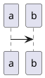
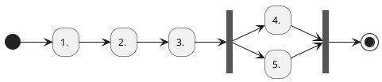
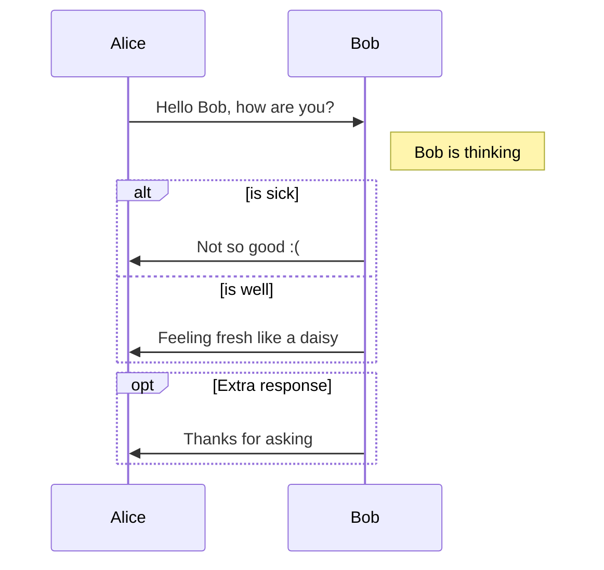
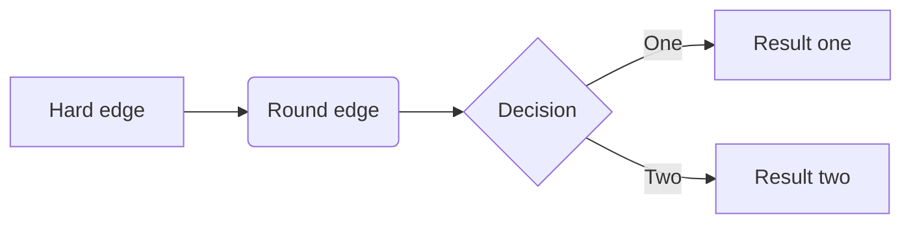
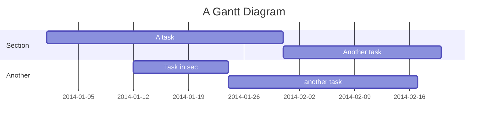

# plantuml

```plantuml

@startuml

a->b
@enduml
```

```plantuml
@startuml
left to right direction
skinparam monochrome true
skinparam shadowing false
(*) -->"1. "
-->"2. "
--> "3. " 
--> ===B1===
===B1=== --> "4. " 
--> ===B2===
===B1=== --> "5. " 
--> ===B2===
--> (*)
@enduml
```

```plantuml, autorun

@startuml
a->b
@enduml
```

# mermaid

```mermaid
%% Example of sequence diagram
  sequenceDiagram
    Alice->>Bob: Hello Bob, how are you?
    Note right of Bob: Bob is thinking
    alt is sick
    	Bob->>Alice: Not so good :(
    else is well
    	Bob->>Alice: Feeling fresh like a daisy
    end
    opt Extra response
    	Bob->>Alice: Thanks for asking
    end
```

## Flowchart

```mermaid
  graph LR
    A[Hard edge] -->B(Round edge)
    B --> C{Decision}
    C -->|One| D[Result one]
    C -->|Two| E[Result two]
```

## Gantt diagrams

```mermaid
  gantt
    title A Gantt Diagram
    dateFormat  YYYY-MM-DD
    section Section
    A task           :a1, 2014-01-01, 30d
    Another task     :after a1  , 20d
    section Another
    Task in sec      :2014-01-12  , 12d
    another task      : 24d
```

```mermaid
  gantt
    title A Gantt Diagram
    dateFormat  YYYY-MM-DD
    section Section
    A task           :a1, 2014-01-01, 30d
    Another task     :after a1  , 20d
    section Another
    Task in sec      :2014-01-12  , 12d
    another task      : 24d
```